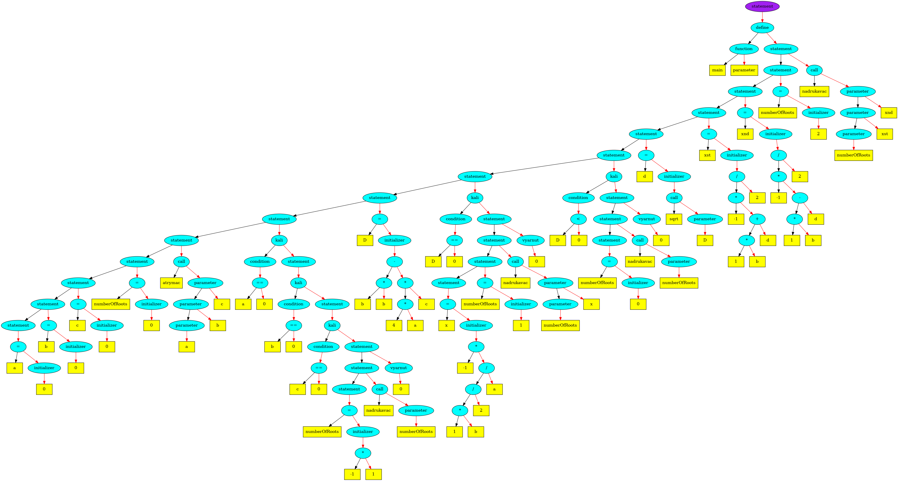

# BelLanguage
## Brief introduction

This my programming language. It is a final project of 1st semestr compiler course I've taken this year. Language is Turing full. It consists of belarusian words written in latin. However, it doesn't yet support cyrillic symbols. Hopefully, I will add them. The language itself is a mix of Pascal and C, but all keywords are in belarusian. Here are simple programs written in my language.

Factorial:
```cpp
main ()
pachac
	a = 0;
	atrymac (a);
	b = factorial (a);
	nadrukavac (b)
	
skoncyc

factorial (n)
pachac
	kali (n == 1)
	pachac
		vyarnut 1
	skoncyc;
	
	a = n - 1;
	b = factorial (a);

	c = n * b;
	
	vyarnut c
skoncyc

```

Square equation solver:
```cpp
main ()
pachac
	a = 0;
	b = 0;
	c = 0;
	numberOfRoots = 0;
	atrymac (a, b, c);

	kali (a == 0)
	pachac
		kali (b == 0)
		pachac
			kali (c == 0)
			pachac
				numberOfRoots = -1;
				nadrukavac (numberOfRoots);

				vyarnut 0
			skoncyc
		skoncyc
	skoncyc;

	D = b * b - 4 * a * c;

	kali (D == 0)
	pachac
		x = -1 * b / 2 / a;
		numberOfRoots = 1;
		nadrukavac (numberOfRoots, x);

		vyarnut 0
	skoncyc;

	kali (D < 0)
	pachac
		numberOfRoots = 0;
		nadrukavac (numberOfRoots);

		vyarnut 0
	skoncyc;

	d = sqrt (D);
	xst = (-1 * b + d) / 2;
	xnd = (-1 * b - d) / 2;
	
	numberOfRoots = 2;
	
	nadrukavac (numberOfRoots, xst, xnd)

skoncyc
```

## Language rules

Here I will list some of the keywords for those who want to try to code something.

Let's start with variables. Only INTEGERS are supprted yet. Thus, variables don't have types. To create a varibale, you simply need to:
```
a = 0;
```
It means that you've created variable named "a".

Conditional structure:
```
kali (a == 0)
pachac
    a = 5;
    b = 8;
    c = 0
skoncyc
```

The most important part of the language that differs it from C is ';'. It's being used to connect operators, not to mention the end of it. As a result, you don't need to put ';' after the last operator in the block. Blocks are all structures supported in my language except functions definitions.

Loop structure:
```
kali (a == 0)
pachac
    a = 5;
    b = 8;
    c = 0
skoncyc
```

As you can see from the above, it almost the same as conditional structure.

Functions definition and call:
```
factorial (n)
pachac
	kali (n == 1)
	pachac
		vyarnut 1
	skoncyc;
	
	a = n - 1;
	b = factorial (a);

	c = n * b;
	
	vyarnut c
skoncyc
```

To define function you don't need to specify type of it because my language doesn't support this feature. Moreover, function return value can be immediately assigned to left variable.

Standard in/out functions:
```
nadrukavac(a, b, c)
atrymac (a, d, g)
```

These functions support variable number of args. As a result, you can type ```nadrukavac(a)``` and ```nadrukavac(a, b, c, d)``` and it'll work.

## Compilation

How is compilation going?

The project itself consists of 3 major parts: frontend, backend, and cpu.
1. Frontend


It is used to create AST (Abstract Syntax Tree) and saves it in IR (intermediate representation). First of all, file with code is divided into lexems. After that, frontend builds an AST from them. Visual representation of this tree is below:

This is AST for Square equation solver

2. Backend


This part of the program is responsible for translating AST into asm code for my SoftCPU. It rtaverses the tree and print in file asm instructions.

3. SoftCPU


It runs program. Processor translates asm code from backend to binary and, then, executes it.

Also, there is a driver which runs all parts of the compiler.

## Installation

```
$ git clone https://github.com/andreyStrachuk/BelLanguage
$ cd BelLanguage
$ make
$ ./belcc filename.txt